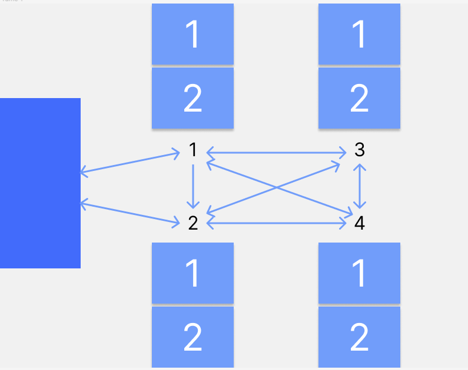
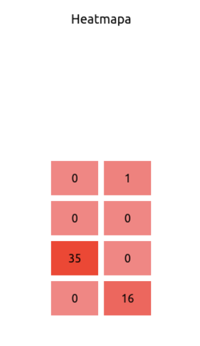
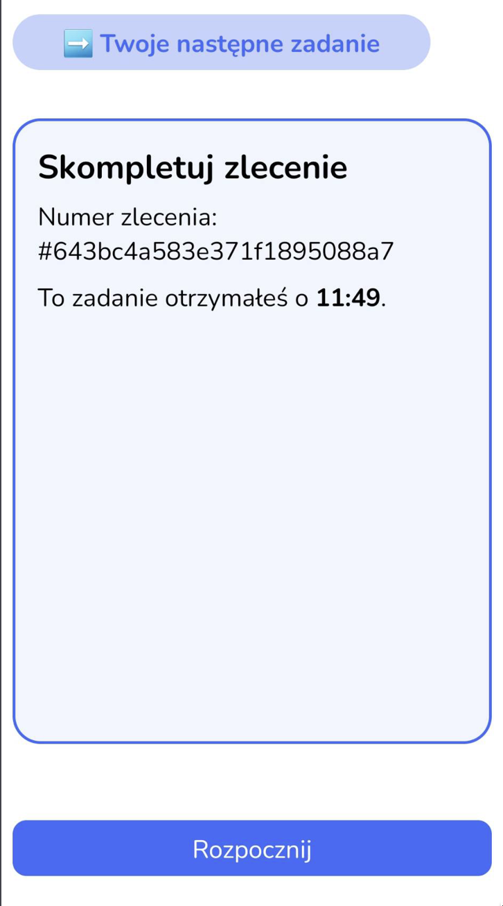
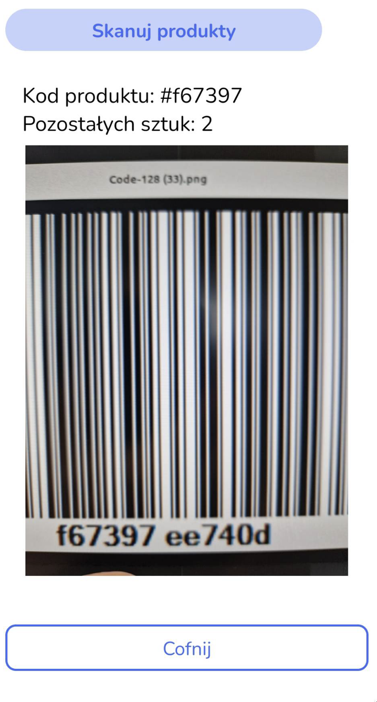

# Dokumentacja Projektu - Ale to Ty dzwonisz?!

## 👋 Zespół 

Nasz zespół:
- [Mikołaj Szawerda](https://github.com/MikolajSzawerda)
- [Dawid Kaszyński](https://github.com/dawidkasz)
- [Jakub Jażdżyk](https://github.com/kubajaz)
- [Marcin Jarczewski](https://github.com/Percival33)

## Wstęp

Projekt "Magazyn 4.0" ma na celu optymalizację nakładu pracy **pracowników magazynów** poprzez zastosowanie innowacyjnych technologii oraz narzędzi analitycznych. Główne funkcje naszego rozwiązania obejmują optymalizację trasy pokonywanej przez pracowników, równomiernego rozłożenia pracy, a także monitorowanie i raportowanie danych statystycznych. Wszystko to jest dostępne dzięki interfejsowi w postaci intuicyjnej aplikacji mobilnej dla pracowników.

## Funkcje

### Optymalizacja trasy pokonywanej przez pracowników

Nasz system analizuje dane zebrane z magazynu, aby obliczyć najbardziej efektywną trasę dla pracowników, co pozwala im zaoszczędzić czas i energię. System uwzględnia lokalizacje przedmiotów oraz aktualne zamówienia.

Do tego celu wykorzystujemy zewnętrzne biblioteki: `scipy`, `numpy` aby efektywnie obliczać najkrótsze ścieżki dla pracowników przy wykorzystaniu algorytmu `Floyda-Warshalla`.

- Pierwszym krokiem algorytmu podczas pierwszego uruchomienia serwera są liczone odległości między wszystkimi punktami.
- Dalej w momencie optymalizowania trasy danego pracownika, przetwarzane są wszystkie punkty, w których znajdują się towary objęte w danym zamówieniu.
- Następnie korzystając z wcześniej obliczonych danych wybierana jest najbardziej optymalna ścieżka.

Sam magazyn przechowujemy jako graf gdzie wierzchołkiem jest kolumna w regale magazynowym. Dodatkowo zadbaliśmy o zmniejszenie liczby krawędzi by uniezależnić się od pojedynczego przypadku topologii.

<h4>🖼️ widok magazynu</h4>

### Równomiernego rozłożenia pracy

Rozwiązanie analizuje obciążenie pracy każdego pracownika, aby zapewnić równomierny podział obowiązków. Dzięki temu pracownicy nie są przeciążeni, co prowadzi do większej produktywności i satysfakcji z pracy.

Nasza aplikacja wylicza odległości jakie pokonuje każdy pracownik. Do kolejnego zadania przydziela pracownika, który wykonał najmniej zleceń. W przypadku, gdy jest więcej takich pracowników, wybierany jest pierwszy z nich.

W przyszłości można uwzględnić dodatkowo wiek oraz odpowiednie uprawnienia, które pozwalają na obsługiwanie podnośników w przypadku gdy towary umieszczone są wysoko.

### Dashboard

Oprócz aplikacji mobilnej zaimplementowaliśmy dashboard, który umożliwia monitorowanie zgłaszanych usterek przez pracowników. Dzięki temu zarządzający mają świadomość problemów występujących na terenie magazynu i mogą szybko reagować na te sytuacje.

- Dashboard wykonaliśmy w technologii webowej, z wykorzystaniem biblioteki `React`.

<h4>🖼️ widok dashboardu</h4>

### Statystyki

System zbiera dane dotyczące odległości pokonanej przez pracowników podczas wykonywania obowiązków. Ułatwia to zarządzanie zasobami ludzkimi oraz pozwala na optymalizację procesów w magazynie. Ponadto w przypadku zgromadzenia większej liczby danych jest szansa na przewidywanie ile będzie trwać wykonanie danego zlecenia.

### Heatmapa

Heatmapa pokazuje gdzie znajdują się przedmioty, które są najbardziej pożądane w magazynie. Umożliwia to zoptymalizowanie układu magazynu oraz przyśpieszenie procesów realizacji zamówień. Może to się odbywać poprzez zmianę miejsc produktów wchodzących w typowe obsługiwane zamówienie.

<h4>🖼️ widok heatmapy</h4>

## Aplikacja mobilna

Interfejs użytkownika został zaprojektowany tak, aby jak najbardziej być intuicyjny i prosty w obsłudze. Aplikacja mobilna dla pracowników magazynów pozwala na wyświetlanie najważniejszych informacji oraz wykonywanie podstawowych zadań związanych z realizacją zamówień.

- Aplikacje wykonaliśmy z wykorzystaniem biblioteki `React Native`.

Do tych informacji należy

- instrukcja prowadząca pracownika krok po kroku, minimalizując nie potrzebne informacje, najkrótszą ścieżką po wszystkich punktach z których kompletowane jest zamówienie. W ramach tego pokazujemy: numer regału, kolumny oraz półki gdzie znajduje się dany przedmiot oraz liczbę sztuk danego przedmiotu która wchodzi w skład naszego zamówienia.

- Wymiana informacji między pracownikiem a pracodawcą odbywa się w czasie rzeczywistym poprzez wykorzystanie gniazd. To daje nam możliwość zgłaszania występujących usterek w czasie rzeczywistym jak również skanowania kompletowanych produktów aby maksymalnie usprawnić i ujednolicić stan rzeczywisty z stanem systemowym. W tym celu posługujemy się skanerem kodów kreskowych.

<h4>🖼️ widoki aplikacji</h4>

### Skanowanie kodów kreskowych

Aplikacja mobilna umożliwia skanowanie kodów kreskowych produktów, co pozwala na sprawdzenie zgodności zamówienia ze stanem magazynowym oraz szybkie zaktualizowanie danych w systemie. Każdy produkt, posiada unikalny kod identyfikujący, który pozwala na weryfikację czy pakowany produkt jest tym właściwym.

<h4>🖼️ widok aplikacji w czasie obsługiwania zamówienia</h4>

<h4>🖼️ widok aplikacji w czasie obsługiwania usterki</h4>

## Technologie

Nasz zespół wykorzystał:
- `FastAPI` do zastosowania backendowego, obługujące websockety, komunikację z bazą danych oraz zasialnie danych do dashboardu
- `React Native` do aplikacji mobilnej dla uzytkownika końcowego, obsługująca skanowanie kodów kreskowych, 
zgłaszanie usterek i obsługi zamówień przy uzyciu websocketów
- `React` do stworzenia dashboardu dla zarządcy magazynu
- `MongoDB` do przechowywania danych o produktach w magazynie, ich lokalizacji, liczbie oraz do obsługi zamówień

## Podsumowanie

Projekt "Magazyn 4.0" ma na celu zwiększenie efektywności pracy w magazynach, poprzez optymalizację procesów i równomierny podział obowiązków. Wdrożenie naszego rozwiązania przyczynia się do oszczędności czasu i energii pracowników, co przekłada się na zwiększenie produktywności oraz satysfakcji z pracy. Interfejs w postaci intuicyjnej aplikacji mobilnej umożliwia zarówno pracownikom, jak i zarządzającym monitorowanie ważnych statystyk, zgłaszanie usterek oraz optymalizowanie układu magazynu.

Wszystko to przyczynia się do stworzenia nowoczesnego, efektywnego i przyjaznego środowiska pracy, które pozwala firmom na osiągnięcie wyższych standardów zarządzania magazynem i lepsze zaspokojenie potrzeb klientów. Wprowadzenie takiego rozwiązania daje przewagę konkurencyjną na rynku, wpływając na dalszy rozwój i sukces przedsiębiorstwa.
